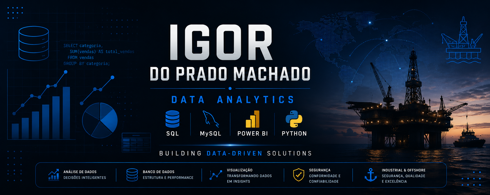

  

<h1 align="center">
Olá, eu sou Igor do Prado Machado 👋
</h1>

<h3 align="center">
Data Analytics • SQL • Python • Power BI
</h3>

Transformando dados em decisões.

# 👋 Olá, eu sou Igor do Prado Machado

🎯 Em formação em Análise de Dados  
💻 Estudante de Tecnologia da Informação  
📊 Construindo projetos reais com SQL, Python, Power BI e Excel

---

## 👨‍💻 Sobre mim

Minha experiência no setor industrial me proporcionou uma base sólida em processos, segurança e resolução de problemas. Atualmente direciono essa vivência para a área de Data Analytics, desenvolvendo projetos com SQL, modelagem de bancos de dados, Python e Power BI para transformar dados em informações úteis para a tomada de decisão.

---

## 🚀 Tecnologias

  
  
  
  
  
  

---

## 📂 Projetos

## 📊 Plano B Analytics

Sistema de análise de dados desenvolvido para simular um ambiente real de Business Intelligence utilizando MySQL.

### 🎯 Objetivo
Transformar dados de vendas e estoque em informações estratégicas para apoiar a tomada de decisão.

### 🛠 Tecnologias
- MySQL
- SQL
- Git & GitHub
- Power BI (em desenvolvimento)

### 📌 Funcionalidades
- ✅ Modelagem de banco de dados relacional
- ✅ Controle de produtos, compras e vendas
- ✅ Views analíticas
- 🟡 Stored Procedures
- 🟡 Triggers
- ⏳ Dashboard em Power BI

### 📈 Indicadores
- Ranking de produtos mais vendidos
- Receita total
- Ticket médio
- Controle de estoque
- Produtos sem movimentação

**Status:** 🟢 Em desenvolvimento

🔗 Repositório:
https://github.com/BFRIGOR7/Plano-B-Analytics

---

### ₿ Bitcoin Analytics
Projeto para análise exploratória de dados históricos do Bitcoin, utilizando Python para tratamento dos dados e Power BI para visualização.

Status: ⏳ Planejado

---

### 🇧🇷 Brasil em Dados
Exploração de dados públicos brasileiros utilizando ferramentas de análise.
Projeto voltado à análise de indicadores públicos brasileiros, explorando dados governamentais para gerar insights e dashboards.

Status: ⏳ Planejado

---

## 🌊 Jornada Offshore

Atualmente estou construindo minha carreira no setor **Industrial e Offshore**, buscando evolução contínua por meio de experiência prática, certificações e qualificação profissional.

### ✅ Certificações Concluídas

- Pintura Industrial
- CBSP
- THUET
- IRATA Nível 1
- NR-33
- NR-34
- NR-35

### 🟡 Em andamento

- Emissão do Passaporte
- Processo do CFAQ (Marinha)
- Obtenção da CIR

### 🎯 Próximos Objetivos

- IRATA Nível 2
- Curso Técnico em Mecânica
- Atuação em operações offshore
- Desenvolvimento contínuo na carreira internacional

---

## 📈 Roadmap

## 📅 Atualmente

🚀 Atualmente estudando

- SQL para análise de dados
- Python para Data Analysis
- Power BI
- Estatística aplicada
- Git e GitHub

### 📊 Data Analytics

- ✅ SQL
- ✅ Modelagem de Banco de Dados
- 🟡 Procedures
- 🟡 Triggers
- 🟡 Power BI
- 🟡 Python para Análise de Dados
- ⏳ Dashboards Interativos
- ⏳ Projetos com APIs
- ⏳ Portfólio Completo

---

### 🌊 Carreira Offshore

- ✅ Pintura Industrial
- ✅ CBSP
- ✅ THUET
- ✅ IRATA Nível 1
- 🟡 Passaporte
- 🟡 CFAQ
- ⏳ CIR
- ⏳ IRATA Nível 2
- ⏳ Curso Técnico em Mecânica
- ⏳ Oportunidades Offshore Nacionais e Internacionais

---

## 📫 Contato

📧 igorprado1515@gmail.com

💼 LinkedIn: www.linkedin.com/in/profissionaligorpm7

---

## 📊 GitHub Stats

  

---

## 🏆 Conquistas

- Desenvolvimento do primeiro projeto completo de análise de dados utilizando MySQL
- Criação de banco de dados relacional com modelagem, views analíticas e consultas SQL
- Construção de portfólio técnico unindo experiência industrial e tecnologia
